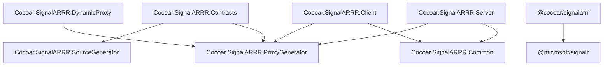

<!-- Generated from website/reference/packages.md by website/scripts/sync-skill.mjs. Do not edit; edit the docs page. -->

# Packages

SignalARRR is distributed as multiple NuGet packages and one npm package. Choose the packages that match your project's role.

## .NET Packages

| Package | Target | Purpose |
|---------|--------|---------|
| `Cocoar.SignalARRR.Contracts` | net8.0 / net9.0 / net10.0 | `[SignalARRRContract]` attribute + Roslyn source generator. Reference from shared interface projects. |
| `Cocoar.SignalARRR.Server` | net8.0 / net9.0 / net10.0 | Server-side: `HARRR` hub, `ServerMethods<T>`, authorization, `ClientManager`, streaming. |
| `Cocoar.SignalARRR.Server.Backplane.Redis` | net8.0 / net9.0 / net10.0 | Multi-node scale-out: `AddSignalARRRRedisBackplane`. Add only when running more than one node — this is where the `StackExchange.Redis` dependency lives. |
| `Cocoar.SignalARRR.Server.Backplane.Postgres` | net8.0 / net9.0 / net10.0 | Multi-node scale-out over PostgreSQL `LISTEN`/`NOTIFY`: `AddSignalARRRPostgresBackplane`. For deployments whose only stateful dependency is Postgres — this is where the `Npgsql` dependency lives. |
| `Cocoar.SignalARRR.Client` | net8.0 / net9.0 / net10.0 | Client-side: `HARRRConnection`, typed proxies, server-to-client handlers. |
| `Cocoar.SignalARRR.Client.FullFramework` | netstandard2.0 (.NET Framework 4.6.2+) | Client for .NET Framework — typed proxies via `DispatchProxy`, streaming via polyfills. |
| `Cocoar.SignalARRR.DynamicProxy` | net8.0 / net9.0 / net10.0 | Optional runtime proxy fallback via `DispatchProxy`. For plugin/dynamic scenarios. |

### Internal packages

These packages are referenced transitively — you normally don't need to reference them directly:

| Package | Purpose |
|---------|---------|
| `Cocoar.SignalARRR.Common` | Shared types, wire protocol constants, message models |
| `Cocoar.SignalARRR.ProxyGenerator` | Base classes for proxy creation (`ProxyCreator`, `ProxyCreatorHelper`) |
| `Cocoar.SignalARRR.SourceGenerator` | Roslyn incremental source generator (bundled in Contracts) |

## npm Package

| Package | Version | Purpose |
|---------|---------|---------|
| `@cocoar/signalarrr` | 5.0.0 | TypeScript/JavaScript client: `HARRRConnection`, `invoke`, `send`, `stream`, `onServerMethod` |

### Peer dependency

The npm package requires `@microsoft/signalr` ^10.0.0:

```bash
npm install @cocoar/signalarrr @microsoft/signalr
```

## Swift Package

| Package | Purpose |
|---------|---------|
| `CocoarSignalARRR` | Core Swift client: `HARRRConnection`, `invoke`, `send`, `stream`, `onServerMethod`, stream references |
| `CocoarSignalARRRMacros` | `@HubProxy` macro for compile-time proxy generation from Swift protocols |

### Dependencies

- `signalr-client-swift` (1.0.0-preview.1+) — Microsoft's SignalR Swift client
- `swift-syntax` (510.0.0+) — for macro code generation

### Swift Package Manager

```swift
dependencies: [
    .package(url: "https://github.com/cocoar-dev/Cocoar.SignalARRR.git", from: "5.0.0"),
],
targets: [
    .target(
        name: "MyApp",
        dependencies: [
            .product(name: "CocoarSignalARRR", package: "Cocoar.SignalARRR"),
            .product(name: "CocoarSignalARRRMacros", package: "Cocoar.SignalARRR"),
        ]
    ),
]
```

**Platforms:** iOS 14+, macOS 11+, tvOS 14+, watchOS 7+

## Typical project setup

### Shared interfaces (class library)

```xml
<Project Sdk="Microsoft.NET.Sdk">
  <PropertyGroup>
    <TargetFramework>net8.0</TargetFramework>
  </PropertyGroup>
  <ItemGroup>
    <PackageReference Include="Cocoar.SignalARRR.Contracts" Version="5.*" />
  </ItemGroup>
</Project>
```

### Server (ASP.NET Core)

```xml
<ItemGroup>
  <PackageReference Include="Cocoar.SignalARRR.Server" Version="5.*" />
  <ProjectReference Include="..\Shared\Shared.csproj" />
</ItemGroup>
```

Optional multi-node scale-out — separate packages, so single-node applications pull in neither
`StackExchange.Redis` nor `Npgsql`. Pick one:

```xml
<ItemGroup>
  <PackageReference Include="Cocoar.SignalARRR.Server.Backplane.Redis" Version="5.*" />
</ItemGroup>
```

```csharp
builder.Services.AddSignalARRRRedisBackplane(options => options
    .WithConnectionString("localhost:6379,abortConnect=false"));
```

This backplane is Redis-compatible and works with Redis, Valkey, and Garnet.

```xml
<ItemGroup>
  <PackageReference Include="Cocoar.SignalARRR.Server.Backplane.Postgres" Version="5.*" />
</ItemGroup>
```

```csharp
builder.Services.AddSignalARRRPostgresBackplane(options => options
    .WithConnectionString("Host=db;Database=app;Username=app;Password=..."));
```

This backplane uses the PostgreSQL primary your application already has; see
[Backplane & Clustering](../guide/server/backplane.md) for how to choose between the two.

### .NET Client (Console / WPF / etc.)

```xml
<ItemGroup>
  <PackageReference Include="Cocoar.SignalARRR.Client" Version="5.*" />
  <ProjectReference Include="..\Shared\Shared.csproj" />
</ItemGroup>
```

### .NET Framework Client (4.6.2+ / 4.8)

For legacy .NET Framework projects (e.g., SCCM/SCSM integration, WinForms, WPF on .NET Framework):

```xml
<ItemGroup>
  <PackageReference Include="Cocoar.SignalARRR.Client.FullFramework" Version="5.*" />
</ItemGroup>
```

> **Info: No shared interface project needed**
>
> The FullFramework client uses `DispatchProxy` at runtime. Define the same interface in your .NET Framework project (same namespace and method names) — no `[SignalARRRContract]` attribute needed.

### TypeScript Client

```json
{
  "dependencies": {
    "@cocoar/signalarrr": "^5.0.0",
    "@microsoft/signalr": "^10.0.0"
  }
}
```

## Agent skill

`Cocoar.SignalARRR.Server` ships an [Agent Skill](https://agentskills.io/) — a `SKILL.md` plus
this documentation page by page as reference files — so a coding assistant in your project knows
the library's API and the mistakes it would otherwise make. It sits in a `skills/` folder at the
package root and takes no part in your build or your IDE: nothing is copied or shown anywhere
unless you install it.

With [agentskills-cli](https://mysticmind.github.io/agentskills-cli/):

```bash
dotnet tool install --global agentskills-cli
agentskills-cli add Cocoar.SignalARRR.Server
```

That places the skill in `.claude/skills/` for Claude Code and `.agents/skills/` for Cursor,
Codex, Copilot and other agents that read the standard; `-g` installs it globally instead. Without
the tool, copy `skills/signalarrr/` out of the package into the same folders by hand.

The skill is generated from these docs, so it says what the docs say for the version you
reference. The same content is available online as [llms.txt](https://docs.cocoar.dev/signalarrr/llms.txt.html) (an index with one line
per page) and [llms-full.txt](https://docs.cocoar.dev/signalarrr/llms-full.txt.html) (everything in one file) for assistants that fetch
documentation by URL.

## Dependency graph



## Next steps

- [Getting Started](../guide/getting-started.md) — install and set up
- [API Overview](./api.md) — public API surface
- [Proxy Generation](../guide/advanced/proxy-generation.md) — how the source generator works
