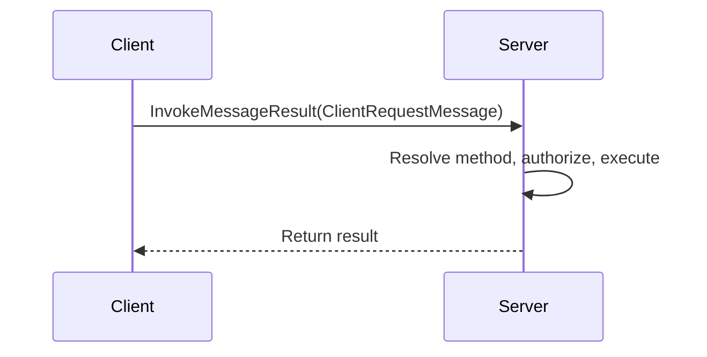
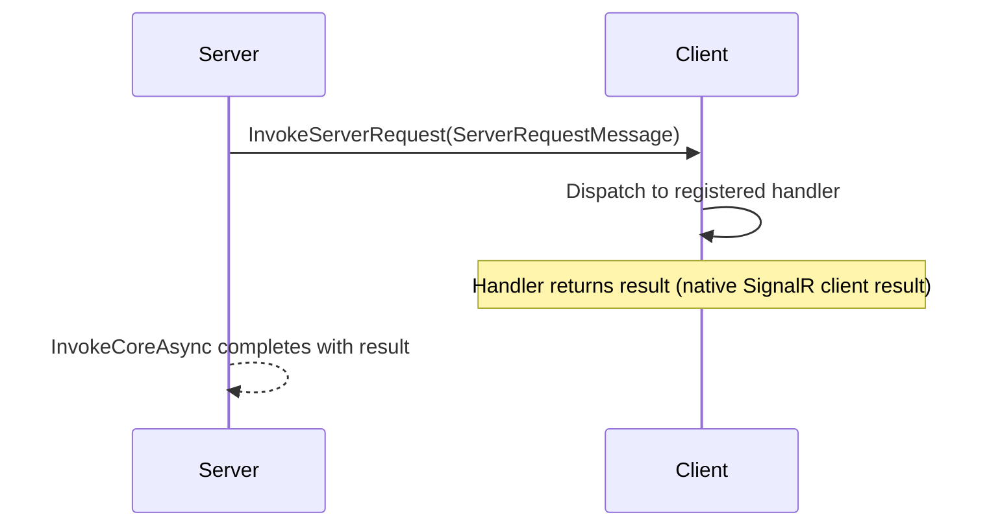
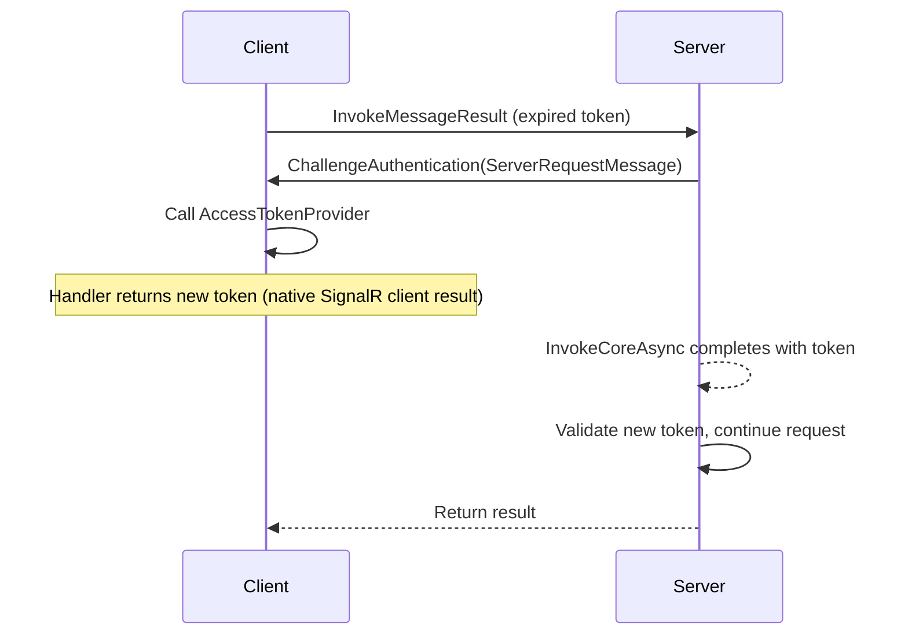
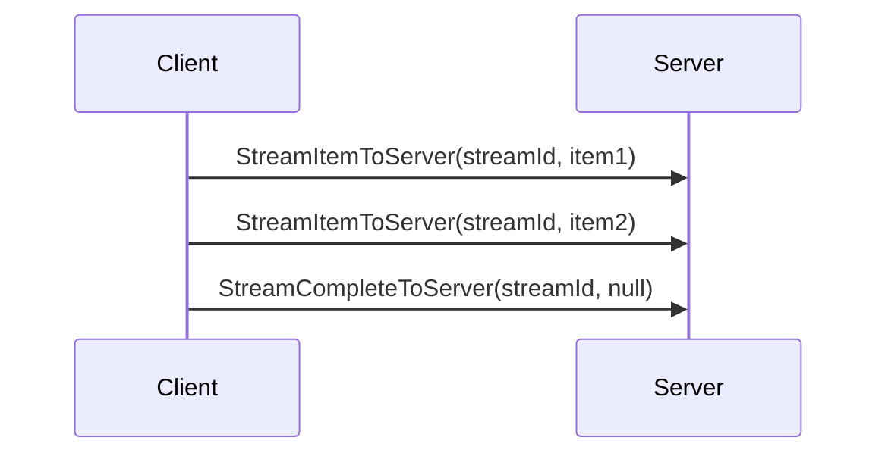

<!-- Generated from website/reference/wire-protocol.md by website/scripts/sync-skill.mjs. Do not edit; edit the docs page. -->

# Wire Protocol

SignalARRR communicates over standard SignalR using a fixed set of hub methods. This page documents the protocol for advanced use cases and custom client implementations.

## Hub method names

### Client → Server

| Hub method | Purpose | Payload | Returns |
|------------|---------|---------|---------|
| `InvokeMessage` | Fire-and-forget (void methods) | `ClientRequestMessage` | — |
| `InvokeMessageResult` | Call with return value | `ClientRequestMessage` | `object` |
| `SendMessage` | Fire-and-forget (Task methods) | `ClientRequestMessage` | — |
| `StreamMessage` | Open a server-to-client stream | `ClientRequestMessage` | `IAsyncEnumerable<object>` |
| `StreamItemToServer` | Send a stream item | `Guid streamId, object item` | — |
| `StreamCompleteToServer` | Complete a stream | `Guid streamId, string? error` | — |

### Server → Client

| Message | Purpose | Payload |
|---------|---------|---------|
| `InvokeServerRequest` | Call client method, expect reply (native client result) | `ServerRequestMessage` |
| `InvokeServerMessage` | Call client method, fire-and-forget | `ServerRequestMessage` |
| `ChallengeAuthentication` | Request fresh auth token | `ServerRequestMessage` |
| `CancelTokenFromServer` | Cancel a client operation | `ServerRequestMessage` (with `CancellationGuid`) |

## Message types

### ClientRequestMessage

Sent from client to server with every RPC call.

```json
{
    "Method": "ChatMethods.SendMessage",
    "Arguments": ["Alice", "Hello!"],
    "Authorization": "Bearer eyJ...",
    "GenericArguments": []
}
```

| Field | Type | Required | Description |
|-------|------|----------|-------------|
| `Method` | string | Yes | `ClassName.MethodName` or `InterfaceName\|MethodName` |
| `Arguments` | array | Yes | Serialized method arguments |
| `Authorization` | string | No | Bearer token for authenticated methods |
| `GenericArguments` | string[] | No | Type names for generic methods |

### ServerRequestMessage

Sent from server to client for bidirectional RPC.

```json
{
    "Id": "550e8400-e29b-41d4-a716-446655440000",
    "Method": "GetClientName",
    "Arguments": [],
    "CancellationGuid": null,
    "StreamId": null
}
```

| Field | Type | Required | Description |
|-------|------|----------|-------------|
| `Id` | GUID | Yes | Correlation ID — used internally by SignalR's native client results |
| `Method` | string | Yes | Method name to invoke on client |
| `Arguments` | array | No | Method arguments |
| `GenericArguments` | string[] | No | Generic type arguments |
| `CancellationGuid` | GUID | No | Links to `CancelTokenFromServer` for remote cancellation |
| `StreamId` | GUID | No | Stream correlation for client-to-server streams |

### CancellationTokenReference

Marker object placed in `Arguments` where a `CancellationToken` parameter exists. The client detects this and substitutes an `AbortSignal` (TypeScript) or `CancellationToken` (.NET).

```json
{
    "Id": "550e8400-e29b-41d4-a716-446655440001"
}
```

## Protocol flows

### Client calls server (with result)



### Server calls client (with result)



### Token challenge flow



### Client-to-server streaming



## Method name resolution

The server resolves method names in two formats:

| Format | Example | Resolution |
|--------|---------|------------|
| `ClassName.MethodName` | `ChatMethods.SendMessage` | Direct lookup in method collection |
| `InterfaceName\|MethodName` | `IChatHub\|SendMessage` | Interface-based lookup (used by typed proxies) |

## Next steps

- [API Overview](./api.md) — public API surface
- [Packages](./packages.md) — package guide
- [Cancellation Propagation](../guide/advanced/cancellation.md) — cancellation protocol
