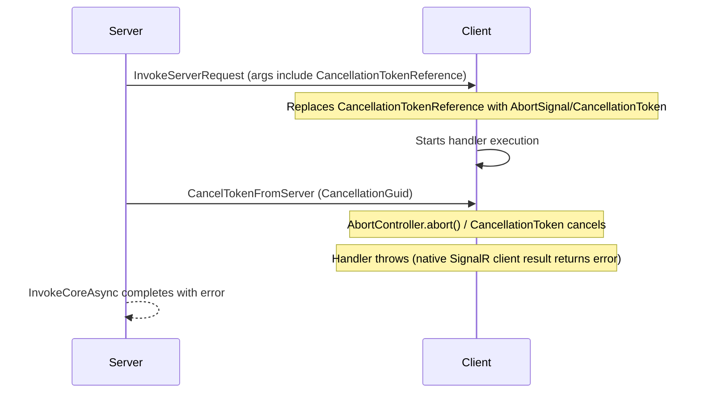

# Cancellation Propagation

SignalARRR supports server-initiated cancellation of client operations. The server can pass a `CancellationToken` to a client method and cancel it remotely. On the TypeScript client, `CancellationToken` is converted to an `AbortSignal`.

## Server side

When a server method calls a client method with a `CancellationToken` parameter, SignalARRR serializes a `CancellationTokenReference` marker and tracks it:

```csharp
public async Task StartLongRunningTask()
{
    using var cts = new CancellationTokenSource();

    var client = ClientContext.GetTypedMethods<IWorkerClient>();

    // The CancellationToken is propagated to the client
    var task = client.ProcessData("data", cts.Token);

    // Cancel after 5 seconds
    cts.CancelAfter(TimeSpan.FromSeconds(5));

    await task;
}
```

When `cts.Cancel()` is called, the server sends a `CancelTokenFromServer` message to the client with the matching cancellation GUID.

## .NET client

On the .NET client, the `CancellationToken` is received as a standard `CancellationToken`:

```csharp
connection.OnServerRequest("ProcessData", (string data, CancellationToken ct) =>
{
    while (!ct.IsCancellationRequested)
    {
        // Process chunks...
    }
    return "completed";
});
```

## TypeScript client

On the TypeScript client, `CancellationToken` parameters are converted to `AbortSignal`:

```ts
connection.onServerMethod('ProcessData', async (data: string, signal: AbortSignal) => {
    for (let i = 0; i < 100; i++) {
        if (signal.aborted) {
            throw new Error('Cancelled');
        }
        await processChunk(data, i);
    }
    return 'done';
});
```

## How it works



### Internal flow

1. Server serializes `CancellationToken` parameters as `CancellationTokenReference { Id: guid }`
2. Server stores the `CancellationGuid` in the `ServerRequestMessage`
3. Client detects `CancellationTokenReference` in the arguments
4. Client creates an `AbortController` (TypeScript) or `CancellationTokenSource` (.NET) mapped to the GUID
5. Client passes the `AbortSignal`/`CancellationToken` to the handler
6. When the server cancels, it sends `CancelTokenFromServer` with the GUID
7. Client triggers the abort/cancellation

## CancellationManager (TypeScript internals)

The `CancellationManager` class maps GUIDs to `AbortController` instances:

| Method | Description |
|--------|-------------|
| `create(id)` | Creates an `AbortController`, returns its `AbortSignal` |
| `cancel(id)` | Calls `abort()` on the controller, removes from map |
| `remove(id)` | Removes the controller without aborting |

## Next steps

- [Server Method Handlers (TypeScript)](/guide/typescript-client/server-methods) — registering handlers
- [Server-to-Client Handlers (.NET)](/guide/dotnet-client/server-to-client) — .NET handler registration
- [Wire Protocol](/reference/wire-protocol) — protocol message details
