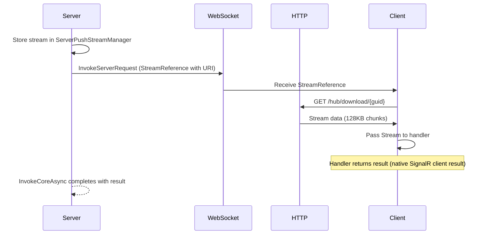

# HTTP Stream References

SignalARRR can transparently transfer large files through what looks like a normal RPC call. When a server-to-client method has a `Stream` parameter, SignalARRR automatically routes the data through HTTP instead of the WebSocket — no code changes needed.

## How it works

When the server calls a client method with a `Stream` argument:

1. Server stores the stream and generates a download URI
2. Only a `StreamReference` (a small JSON object with the URI) is sent over WebSocket
3. Client detects the `Stream` parameter, fetches the actual data via HTTP GET
4. Client receives the stream and passes it to the handler

The developer sees a regular method call with a `Stream` parameter on both sides. The HTTP transfer is invisible.



## Server side

Define an interface with a `Stream` parameter:

```csharp
[SignalARRRContract]
public interface IFileClient
{
    long ProcessFile(string filename, Stream fileStream);
}
```

Call it from a `ServerMethods` class or controller — the stream is automatically routed through HTTP:

```csharp
public class FileMethods : ServerMethods<AppHub>
{
    public async Task<long> SendFileToClient(string filename)
    {
        var fileStream = File.OpenRead($"/data/{filename}");
        var client = ClientContext.GetTypedMethods<IFileClient>();
        return await client.ProcessFile(filename, fileStream);
    }
}
```

You can also pass an HTTP request body directly as a stream:

```csharp
[ApiController]
[Route("api/files")]
public class FileController : ControllerBase
{
    private readonly ClientManager _clients;

    public FileController(ClientManager clients) => _clients = clients;

    [HttpPost("push/{connectionId}")]
    public async Task<IActionResult> PushFile(string connectionId)
    {
        var client = _clients.GetTypedMethods<IFileClient>(connectionId);
        var size = await client.ProcessFile("upload.bin", HttpContext.Request.Body);
        return Ok(new { size });
    }
}
```

## .NET client side

The client handler receives a regular `Stream` — no awareness of the HTTP transfer needed:

```csharp
connection.OnServerRequest("ProcessFile", (string filename, Stream fileStream) =>
{
    using (fileStream)
    {
        // Process the stream — even multi-GB files work
        var length = fileStream.Length;
        return length;
    }
});
```

::: tip Streaming vs Buffered
By default, the resolved stream is buffered in memory. For large files, use the streaming API directly:

```csharp
// .NET — already streaming by default (ReadAsStreamAsync with ResponseHeadersRead)
var resolver = new StreamReferenceResolver(streamRef, context);
var stream = await resolver.ProcessStreamArgument();        // Stream (not buffered)
var bytes = await resolver.ProcessStreamArgumentBuffered(); // byte[] (buffered)
```

```ts
// TypeScript
import { resolveStreamReference, resolveStreamReferenceAsStream } from '@cocoar/signalarrr';
const buffer = await resolveStreamReference(ref);          // ArrayBuffer (buffered)
const stream = await resolveStreamReferenceAsStream(ref);  // ReadableStream (not buffered)
```

```swift
// Swift
let data = try await StreamReferenceResolver.resolve(ref)           // Data (buffered)
let bytes = try await StreamReferenceResolver.resolveAsStream(ref)  // AsyncBytes (not buffered)
```
:::

## Client → Server (Stream as argument)

Clients can also send `Stream` data TO the server. When a `Stream` (.NET), `Blob`/`ArrayBuffer` (TypeScript), or `Data` (Swift) is passed as an argument to a server method, the client automatically uploads it via HTTP before the call:

::: code-group

```csharp [.NET]
var fileStream = File.OpenRead("/data/report.pdf");
await connection.InvokeCoreAsync<string>(
    new ClientRequestMessage("FileMethods.ProcessUpload", new object[] { fileStream }), ct);
```

```ts [TypeScript]
const data = new Blob([fileContent], { type: 'application/octet-stream' });
await connection.invoke('FileMethods.ProcessUpload', data);
```

```swift [Swift]
let data = try Data(contentsOf: URL(fileURLWithPath: "/data/report.pdf"))
try await connection.invoke("FileMethods.ProcessUpload", arguments: data)
```

:::

The server method receives a regular `Stream`:

```csharp
public class FileMethods : ServerMethods<AppHub>
{
    public string ProcessUpload(Stream data)
    {
        using var reader = new StreamReader(data);
        return reader.ReadToEnd();
    }
}
```

::: warning One Stream per Client
A `Stream` can only be read once. Do NOT pass the same `Stream` instance to multiple clients — only the first client would receive data, the others would get empty responses. SignalARRR throws an `InvalidOperationException` if you try.

To send the same file to multiple clients, open a separate `Stream` for each:

```csharp
foreach (var client in clients.GetHARRRClients<AppHub>())
{
    // Each client gets its own FileStream — do NOT reuse the same stream
    using var fileStream = File.OpenRead("/data/movie.mp4");
    var methods = client.GetTypedMethods<IFileClient>();
    methods.ProcessFile("movie.mp4", fileStream);
}
```
:::

## Why not just use WebSocket?

WebSocket connections have practical limits for large binary transfers:

| Concern | WebSocket | HTTP Stream Reference |
|---------|-----------|----------------------|
| Multi-GB files | Message buffer limits, memory pressure | Streamed in 128KB chunks |
| Backpressure | Blocks the hub connection for all clients | Independent HTTP connection |
| Timeout | Hub timeout applies | Separate HTTP timeout |
| Concurrent transfers | Shares the single WebSocket | Parallel HTTP connections |

## Under the hood

### StreamReference

The only thing sent over WebSocket is a small reference object:

```json
{
    "Uri": "http://server/apphub/download/550e8400-e29b-41d4-a716-446655440000"
}
```

### ServerPushStreamManager

Manages both download streams (server → client) and upload slots (client → server). Registered as a singleton. Streams are automatically disposed after transfer or after a 10-minute cleanup timeout.

## Endpoints

`MapHARRRController<T>()` registers the hub and two HTTP endpoints:

```
/apphub                ← SignalR hub
/apphub/download/{id}  ← HTTP stream downloads (server → client)
/apphub/upload/{id}    ← HTTP stream uploads (client → server)
```

## Limitations

- **`Stream` / `Blob` / `Data` types only** — other large types (e.g., `byte[]`) are not automatically intercepted
- **In-memory storage** — download streams are held in memory on the server until the client fetches them (10 minute timeout)
- **One Stream per client** — the same `Stream` instance cannot be sent to multiple clients (see warning above)
- **Download URL uses GUID as access token** — secure over HTTPS, but no user-level authentication on the endpoint

## Next steps

- [Item Streaming: Server-to-Client](/guide/streaming/server-to-client) — IAsyncEnumerable patterns (different from file transfer)
- [Client Manager](/guide/server/client-manager) — push files from controllers
- [Wire Protocol](/reference/wire-protocol) — protocol details
