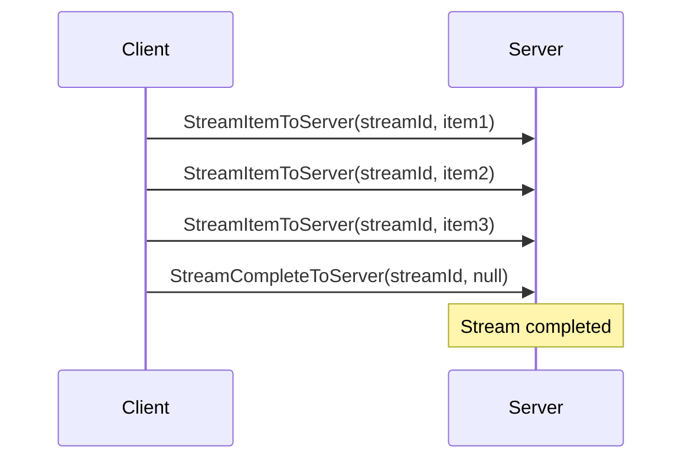

# Client-to-Server Streaming


Clients can stream data to the server using `StreamItemToServer` and `StreamCompleteToServer` hub methods. This enables scenarios like uploading large files, sending telemetry, or live data feeds.

## How it works

The client sends stream items one at a time using the `StreamItemToServer` hub method, identified by a stream GUID. When the stream is complete, the client sends `StreamCompleteToServer`.



## Server-side handling

The `ServerStreamManager` correlates stream items by their GUID and delivers them to the requesting `ServerMethods` class:

```csharp
public class UploadMethods : ServerMethods<AppHub>
{
    private readonly ServerStreamManager _streams;

    public UploadMethods(ServerStreamManager streams) => _streams = streams;

    public async Task ProcessStream(Guid streamId, CancellationToken ct)
    {
        await foreach (var item in _streams.ReadStream<MyItemType>(streamId, ct))
        {
            // Process each streamed item
            await ProcessItem(item);
        }
    }
}
```

## Error handling

The client can signal an error by passing an error message to `StreamCompleteToServer`:

```ts
// TypeScript
connection.asSignalRHubConnection().send('StreamCompleteToServer', streamId, 'Upload cancelled');
```

```csharp
// .NET
connection.AsSignalRHubConnection().SendAsync("StreamCompleteToServer", streamId, "Upload cancelled");
```

## Next steps

- [Server-to-Client Streaming](/guide/streaming/server-to-client) — stream from server to client
- [Wire Protocol](/reference/wire-protocol) — stream protocol details
