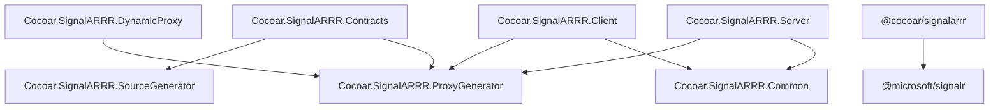

# Packages

SignalARRR is distributed as multiple NuGet packages and one npm package. Choose the packages that match your project's role.

## .NET Packages

| Package | Target | Purpose |
|---------|--------|---------|
| `Cocoar.SignalARRR.Contracts` | net10.0 | `[SignalARRRContract]` attribute + Roslyn source generator. Reference from shared interface projects. |
| `Cocoar.SignalARRR.Server` | net10.0 | Server-side: `HARRR` hub, `ServerMethods<T>`, authorization, `ClientManager`, streaming. |
| `Cocoar.SignalARRR.Client` | net10.0 | Client-side: `HARRRConnection`, typed proxies, server-to-client handlers. |
| `Cocoar.SignalARRR.DynamicProxy` | net10.0 | Optional runtime proxy fallback via `DispatchProxy`. For plugin/dynamic scenarios. Not AOT-compatible. |

### Internal packages

These packages are referenced transitively — you normally don't need to reference them directly:

| Package | Purpose |
|---------|---------|
| `Cocoar.SignalARRR.Common` | Shared types, wire protocol constants, message models |
| `Cocoar.SignalARRR.ProxyGenerator` | Base classes for proxy creation (`ProxyCreator`, `ProxyCreatorHelper`) |
| `Cocoar.SignalARRR.SourceGenerator` | Roslyn incremental source generator (bundled in Contracts) |

## npm Package

| Package | Version | Purpose |
|---------|---------|---------|
| `@cocoar/signalarrr` | 4.0.0 | TypeScript/JavaScript client: `HARRRConnection`, `invoke`, `send`, `stream`, `onServerMethod` |

### Peer dependency

The npm package requires `@microsoft/signalr` ^10.0.0:

```bash
npm install @cocoar/signalarrr @microsoft/signalr
```

## Swift Package

| Package | Purpose |
|---------|---------|
| `CocoarSignalARRR` | Core Swift client: `HARRRConnection`, `invoke`, `send`, `stream`, `onServerMethod`, stream references |
| `CocoarSignalARRRMacros` | `@HubProxy` macro for compile-time proxy generation from Swift protocols |

### Dependencies

- `signalr-client-swift` (1.0.0-preview.1+) — Microsoft's SignalR Swift client
- `swift-syntax` (510.0.0+) — for macro code generation

### Swift Package Manager

```swift
dependencies: [
    .package(url: "https://github.com/cocoar-dev/Cocoar.SignalARRR.git", from: "4.0.0"),
],
targets: [
    .target(
        name: "MyApp",
        dependencies: [
            .product(name: "CocoarSignalARRR", package: "Cocoar.SignalARRR"),
            .product(name: "CocoarSignalARRRMacros", package: "Cocoar.SignalARRR"),
        ]
    ),
]
```

**Platforms:** iOS 14+, macOS 11+, tvOS 14+, watchOS 7+

## Typical project setup

### Shared interfaces (class library)

```xml
<Project Sdk="Microsoft.NET.Sdk">
  <PropertyGroup>
    <TargetFramework>net10.0</TargetFramework>
  </PropertyGroup>
  <ItemGroup>
    <PackageReference Include="Cocoar.SignalARRR.Contracts" Version="4.*" />
  </ItemGroup>
</Project>
```

### Server (ASP.NET Core)

```xml
<ItemGroup>
  <PackageReference Include="Cocoar.SignalARRR.Server" Version="4.*" />
  <ProjectReference Include="..\Shared\Shared.csproj" />
</ItemGroup>
```

### .NET Client (Console / WPF / etc.)

```xml
<ItemGroup>
  <PackageReference Include="Cocoar.SignalARRR.Client" Version="4.*" />
  <ProjectReference Include="..\Shared\Shared.csproj" />
</ItemGroup>
```

### TypeScript Client

```json
{
  "dependencies": {
    "@cocoar/signalarrr": "^4.0.0",
    "@microsoft/signalr": "^10.0.0"
  }
}
```

## Dependency graph



## Next steps

- [Getting Started](/guide/getting-started) — install and set up
- [API Overview](/reference/api) — public API surface
- [Proxy Generation](/guide/advanced/proxy-generation) — how the source generator works
